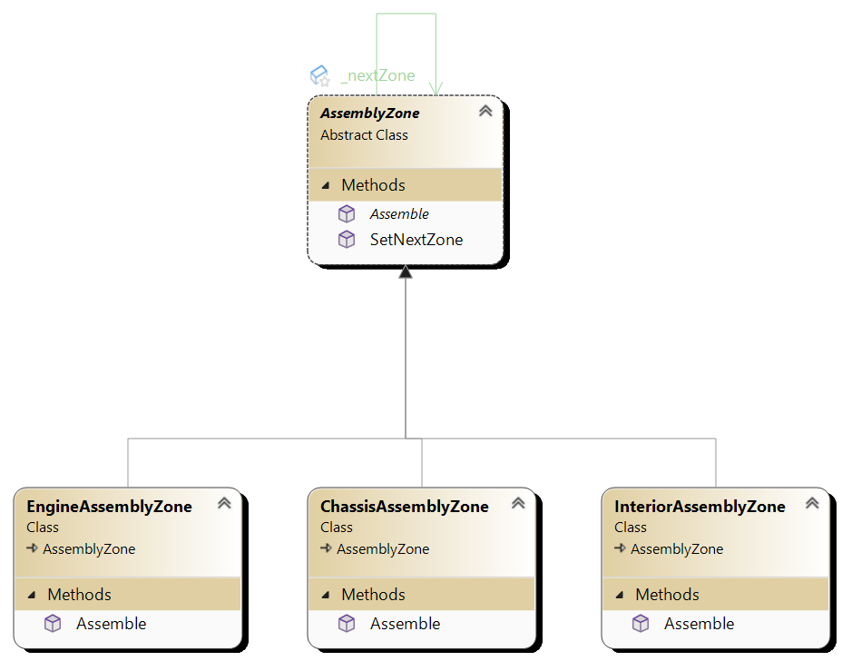

# Chain of Responsibility Pattern

## Intent
The Chain of Responsibility pattern allows an object to send a request along a chain of potential handlers until one of them handles the request.

## Structure
- **Handler**: Defines an interface for handling requests and optionally implements the successor link.
- **ConcreteHandler**: Handles requests it is responsible for, otherwise forwards the request to its successor.

## Example
Consider a manufacturing assembly line where different assembly zones are responsible for assembling different parts of a car. Each assembly zone is capable of handling certain types of parts, and if it cannot handle a part, it passes the part to the next assembly zone in the chain.

## Implementation
- Define a handler interface that declares a method for handling requests and optionally a method for setting the successor.
- Implement concrete handler classes that handle requests they are responsible for and forward others to the next handler.
- Set up a chain of handlers by linking them together, typically using a method to set the successor.

## When to Use
- When multiple objects may handle a request, and the handler should be determined dynamically at runtime.
- When the set of objects that can handle a request should be specified dynamically.

## Benefits
- Decouples senders and receivers of a request.
- Allows requests to be handled by different objects without requiring the sender to know which object will handle the request.
- Provides flexibility in dynamically changing the handling chain or adding/removing handlers without affecting the client.

## Drawbacks
- Can introduce complexity and overhead if the chain is not designed and managed carefully.
- May lead to requests being left unhandled if there is no appropriate handler in the chain.

## Real-World Examples
- Middleware pipelines in web frameworks, where each middleware component can process an HTTP request and pass it to the next middleware in the chain.
- Event handling in graphical user interfaces, where events are passed through a hierarchy of event handlers until one of them handles the event.

## Related Patterns
- **Composite Pattern**: Chain of Responsibility can be implemented using a composite structure where each handler is a composite node that can have child handlers.
- **Command Pattern**: Chain of Responsibility can be combined with Command Pattern where requests are encapsulated as command objects and passed along the chain.

