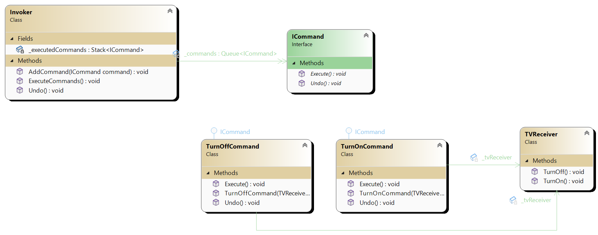

# Command pattern

Command pattern is behavioral design pattern. 

To explain it let’s imagine remote control. Each button has some function. You might expect that each function maps to some function in our class. Instead let’s put each function in each class for example TurnOnCommand class, TurnOffCommand class, IncreaseVolumeCommand class or DecreaseVolumeCommand where each class implements ICommand interface. Each function can be called execute() and also each command can have unexecute() class. This makes command pattern very useful for implementing undo operations. Each command has reference to receiver (actual object that performs action – can be received through constructor. Execute command doesn’t have to be complex – it can just proxy call to receiver.

The fact that each command implements ICommand (is ICommand) makes it easy for client to have for example list of ICommand and then execution operations in order or make undo them.

The main actors are:

1. **Client** who initiates commands
2. **Command** class that has execute and undo methods and implement ICommand
3. **ICommand** interface that each of the command implement. Methods are execute and undo.
4. **Receiver** is actual object that does action. For example it can contain logic for turning of TV. TurnOnCommand will just have reference to TV (received through constructor) and execute method will call this.TV.turnOn() inside it’s execute method.
5. **Invoker** invokes commands

Each command has knowledge of the receiver. For example, TurnOfCommand has reference to TV so logic for turning off doesn’t have to be inside execute method. Execute method can just call method on TV object that actually contains logic for turning off.

Usages:

1. For example inside some GUI explanation like Photoshop each button can call execute method of some particular Command.

## UML diagram

There is invoker which contains list of ICommands and provides methods to execute or undo commands. Each command has Execute and
Undo commands and each command extend ICommand. Each command has reference to receiver that actully provides logic that each
command will execute. In this case this is TVReceiver.

