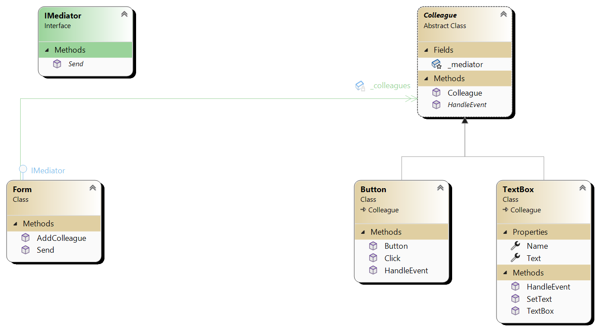

## Mediator Pattern Overview

The **Mediator pattern** is a behavioral design pattern that promotes loose coupling by enabling communication between objects through a mediator (or central authority) instead of directly between objects. This pattern helps manage complex communication and dependencies between objects by reducing direct references among them.

### Components

1. **Mediator (`IMediator`)**:
   - Interface defining a communication contract between colleagues.
   - Declares methods for registering, notifying, and communicating with colleagues.

2. **Concrete Mediator (`Form`)**:
   - Implements the mediator interface (`IMediator`).
   - Manages the interaction and coordination between colleagues.
   - Maintains references to registered colleagues and facilitates communication among them.

3. **Colleague (`Colleague`)**:
   - Abstract base class or interface representing participants in the mediation.
   - Holds a reference to the mediator.
   - Defines a method (`HandleEvent`) for receiving and processing events from the mediator.

4. **Concrete Colleagues (`TextBox`, `Button`, etc.)**:
   - Concrete implementations of the `Colleague` interface.
   - Register with the mediator during instantiation.

### When to Use

- **Complex Communication**: Use the Mediator pattern when you have a complex system where objects need to communicate with each other in a structured way without directly referencing each other.
- **Decoupling**: Use this pattern to promote decoupling between interacting objects by introducing a mediator that manages their interactions.
- **Maintainability**: Employ the Mediator pattern to enhance the maintainability of your code by centralizing communication logic in one place (the mediator) rather than spreading it across multiple objects.

