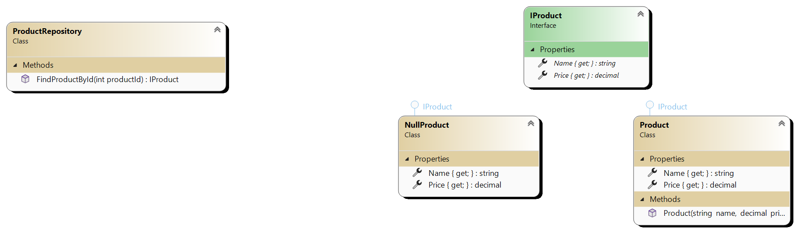

# Null Object Pattern

## Definition

The Null Object pattern replaces null references with neutral objects.

## Main Components

- **Client**: Utilizes objects implementing the interface without having to check for null references.
- **Interface**: Defines the operations that all concrete objects will implement.
- **Concrete Objects**: Implement the interface and provide actual functionality.
- **Null Object**: Implements the same interface but performs no operation or returns default values.

