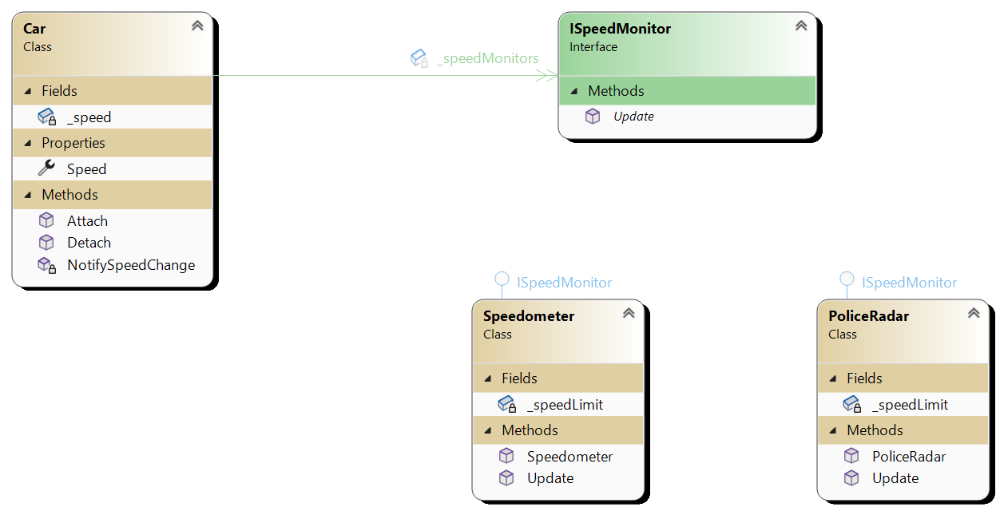
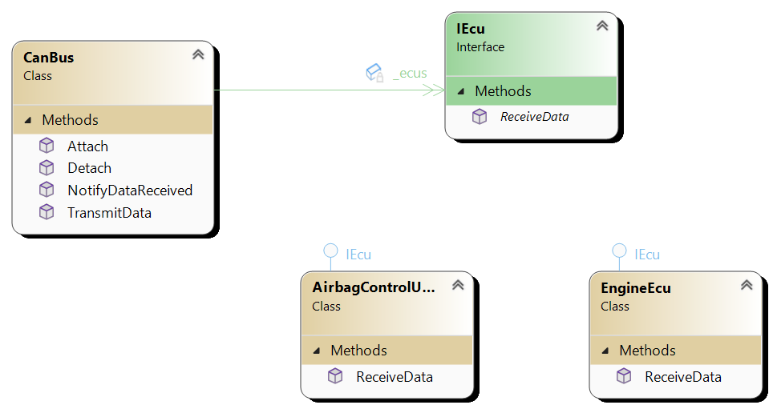

# Observer pattern
Observer design pattern is structural design pattern that defines one-to-many dependency between objects so that
when one object changes all dependant objects are notified and updated automatically.

## Main components
1. **Subject** (Observable) This is the object that holds the state being observed. It has list of observers. Provides
methods to attach, detach and notify observers.
2. **Observer** These are the objects that are interested in the state changes of the subject.

## UML

In first example, Car is object that has state (speed). It has list of observers (objects of type IObserver). In this case
these are Speedometer and Police radar. When speed changes notify method of car goes through list of observers and calls
update method on them.

In second example CanBus is object that has **state**. It has list of IObservers. In this case those are IEcus. AirbagControlUnit
and EngineEcu implement IEcu. When message arrives on CanBus all IEcus are automatically updated.

Example 1:

Example 2:

