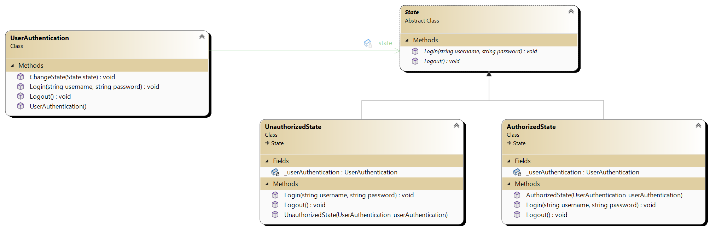

# State Design Pattern

## Definition
The State design pattern is a behavioral design pattern that allows an object to alter its behavior when its internal state changes.
This pattern is useful when the behavior of an object depends on its state and needs to change dynamically at runtime.

## Main Components
1. **Context**: Represents the object whose behavior changes based on its internal state. It maintains a reference to the current state object and 
    delegates state-specific behavior to that object.

2. **State**: Defines an interface or an abstract class for encapsulating the behavior associated with a particular state of the context. 
     Each concrete state subclass implements the behavior associated with a specific state.

3. **Concrete States**: Concrete subclasses of the State interface that implement the behavior associated with a particular state of the context.
   These classes encapsulate the state-specific behavior and handle state transitions.

## Usage
- Use the State pattern when an object's behavior depends on its state, and it needs to change its behavior dynamically at runtime based on state changes.
- This pattern helps to avoid large conditional statements for state-dependent behavior and promotes better separation of concerns by encapsulating each state's behavior in separate classes.
- The State pattern is especially useful in applications where an object's behavior can be modeled as a finite state machine.

