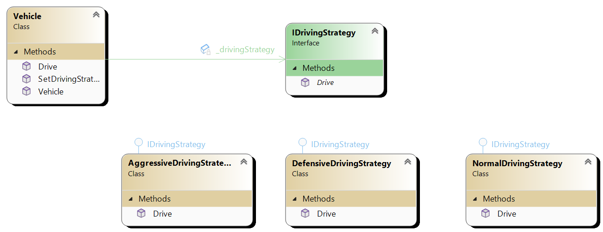

# Strategy pattern
Strategy pattern is behavioural design pattern that definies familily of algorithms that can be interchangable.

## Key Components
1. **Strategy interface**: Defines a common interface for all supported algorithms.
2. **Concrete strategies**: Implement the strategy interface with specific algorithm implementation.
3. **Client**: Has a reference to the current strategy object and allows the client to swith strategies dynamically.

## UML diagram

Vehicle has reference to IDrivingStrategy which receives through constructor. Client, in this case Program.cs can instantite
Vehicle by providing for example NormalDrivingStrategy but can provide any class that implments IDrivingStrategy.

