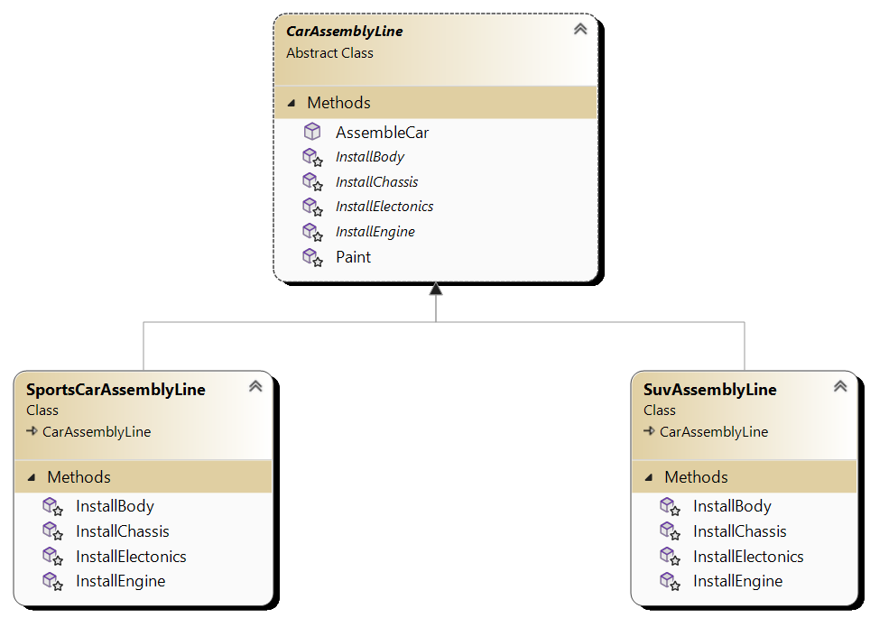

# Template Method Pattern

## Definition

The Template Method Pattern is a behavioral design pattern that defines the skeleton of an algorithm in the superclass but lets 
subclasses override specific steps of the algorithm without changing its structure.

## Main Components

1. **Abstract Class**: Represents the skeleton algorithm and defines the template method that contains the sequence of steps to execute the algorithm. This class may also include abstract methods that subclasses must implement.
2. **Concrete Class**: Implements the abstract methods defined in the abstract class. It provides specific implementations for the steps of the algorithm.

