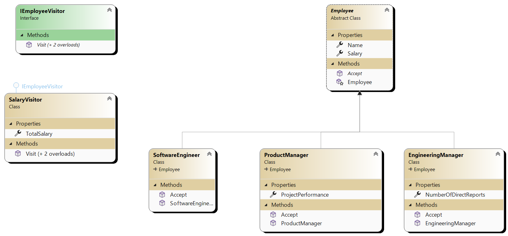

# Visitor Design Pattern

## Intent
- **Intent:** Define operations to be performed on elements of an object structure without changing their classes.

## Problem
- **Problem:** Add new operations to existing classes without modifying them directly.

## Solution
- **Solution:** Separate the operations into visitor classes that can be applied to elements of the structure.

## Structure
- **Elements:** Define an abstract base class/interface (`Element`) with an `accept(Visitor)` method.
- **Visitors:** Implement visitor classes (`Visitor`) with visit methods for each element type.

## Participants
- **Visitor (`Visitor`):** Declares visit methods for concrete elements.
- **Element (`Element`):** Defines `accept(visitor)` method to dispatch operations.

## Use Cases
- **Use Cases:** Extend functionality of classes without altering their implementations.

## Benefits
- **Benefits:** Encapsulate operations, maintain open/closed principle, and support extensibility.

## Example
- **Example:** Calculate total salaries of employees using visitors (`EngineeringManager`, `ProductManager`, `SoftwareEngineer`).

