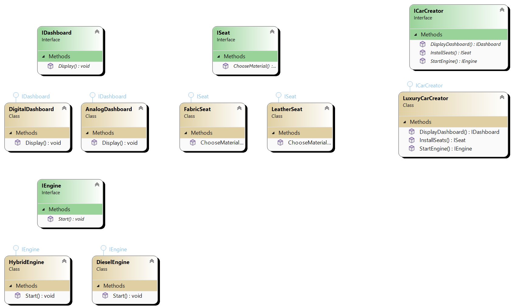
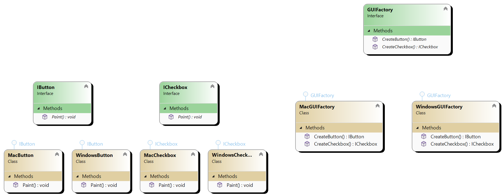

# Abstract method factory

Abstract factory method factory is creational design pattern that provides and interface for creating families of related
without specifing their concrete implementation.

# Main components
1. **Abstract facory** This is the interface or abstract class that declares **set of methods** for creating abstract products.
Each method corresponds to specific product family.
2. **Concrete factory** This is a class that implements the abstract factroy class or interface and is responsible for creating specific products
within specific product family
3. **Abstract Product** This is an interface or abstract class that declares the interface for a type of the product.
4. ** Concrete Product** These are classes that implement the product interface , representing specific product.

So, for example we have ICarCreator which contains **set of methods** that creates family of related parts of the car.
It have methods like AddEngine, InstallDashBoard, AddSeats. Each of those methods returns interface IEngine, IDashboard and ISeat.
Concrete car factory like LuxuryCarFactory will have ofcourse same signature for methods like ICarCreator interface
but it will for method that returns IDashboard return new DigitalDashboard

# UML

In second example we have GUI factory with methods like CreateButton and CreateCheckbox. CreateButton returns IButton and CreateCheckbox
returns ICheckbox. MacGUIFactory is concrete implementation of GUIFactory and will returns for all those methods that implements
Mac related GUI controls: MacButton and MacCheckbox. On the other hand, WindowsGUIFactory will for each of those methods that
implements return Windows related controls: WindowsButton and WindowsCheckbox.

