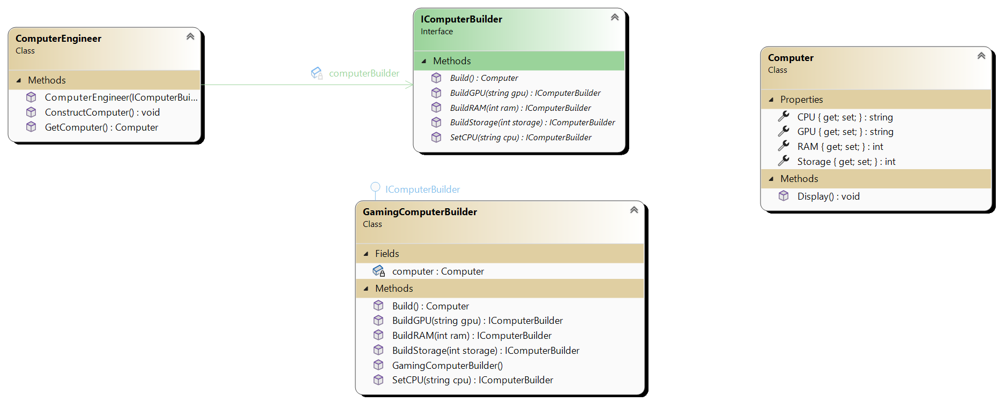

# Builder Design Pattern

## Description
The Builder design pattern is a creational pattern used to construct complex objects step by step. It allows you to produce different types and representations of an object using the same construction code. The construction process remains unchanged, but the resulting object can have different representations.

This pattern is useful when an object requires a lot of parameters to be initialized, especially when some of these parameters are optional. It helps to ensure that the construction of complex objects remains separate from their representation.

## Main Components
The Builder pattern typically consists of the following main components:

1. **Builder**: Defines an interface for creating parts of a complex object.
2. **Concrete Builder**: Implements the Builder interface to construct and assemble parts of the complex object.
3. **Director**: Controls the construction process using a Builder object. It knows the specific order in which to call construction steps.
4. **Product**: Represents the complex object being constructed. It's the final object that's created by the Builder.

# UML 

