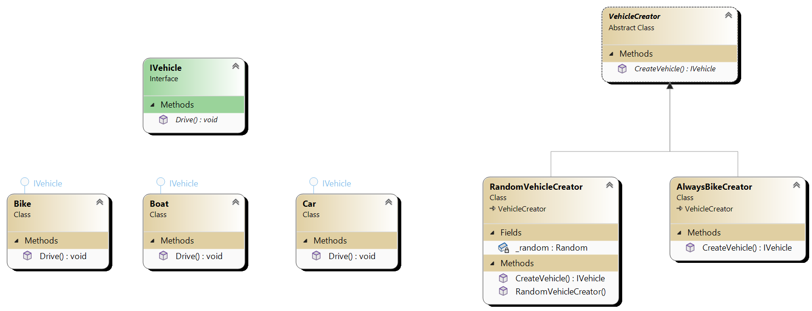

# Factory method

Factory method is creational design pattern that provides interface for creating object but allows subclass to alter
the type of object that will be created. For example we can have VehicleCreator (abstract class or interface)
which multiple subclasses can inherit. Those classses can be AlwaysBikeCreator or RandomVehicleCreator which contains
specific logic for creating objects of type IVehicle

# Main components
1. **Product** This is the interface or abstract class for the objects that factory method create (IProduct, IVehicle...)
2. **Concrete Product** This is concrete implementation of the product interface or abstract class (Car, Boat, Bike classes implement IVehicle)
3. **Abstract factory** This is the abstract class that declares the factory method. Returns object of type Product (like IVehicle)
4. **Concrete factory** These are subclasses of the abstract factory class.

# UML

We have concrete products like Car, Boat and Bike. They are all IVehicle. Multiple different factories creates object of type
IVehicle and have specific logic for creating it. What is important is that factory method returns IVehicle. They all inherit
from VehicleCreator.

