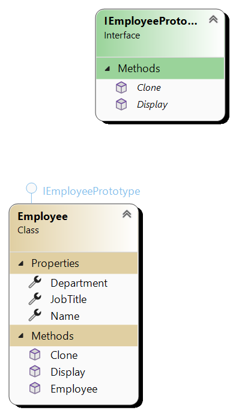

# Prototype Design Pattern

The Prototype pattern is a creational design pattern that allows cloning of objects, creating new objects by copying existing ones. This pattern is useful when the cost of creating a new instance of an object is expensive or complex, and the object to be cloned is in a stable state.

## When to Use the Prototype Pattern

- Use the Prototype pattern when creating new objects by cloning existing ones is more convenient than creating new instances from scratch.
- Use it when you want to avoid subclasses of an object creator in the client application, especially when the number of subclasses may increase over time.

## Key Components

- **Prototype Interface**: Declares the method for cloning itself.
- **Concrete Prototype**: Implements the cloning method defined in the prototype interface.
- **Client**: Creates new objects by cloning existing prototypes.

## Example

Consider a scenario where you have a game development platform. You can use the Prototype pattern to allow users to clone existing game level templates and then modify them to create new game levels. This saves time and resources compared to creating levels from scratch.

## Benefits

- Allows flexible creation of new objects without coupling the client code to their concrete classes.
- Reduces the number of subclasses needed.
- Improves performance by avoiding costly object initialization.

## Limitations

- Deep cloning can be complex, especially when dealing with complex object graphs.
- Cloning can be inefficient for objects with a large number of properties or complex initialization logic.

# UML 

