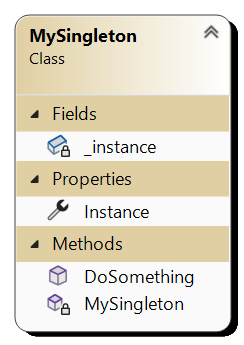

# Singleton pattern
Singleton pattern is creational design pattern.

We used singleton design pattern when we want to create only one instance of a class and prevent a way to create multiple ones. We use **private** constructor so that client is unable to create instances. We also use static factory method or just property that creates new instance only if already does not exist using private constructor.

## Key Components

There is only one component.

1. **Singleton** can be only one instance inside whole app

Singleton must provide global access to object to can be accessed from anywhere. Therefore is sometimes called anti-pattern.

## UML diagram

