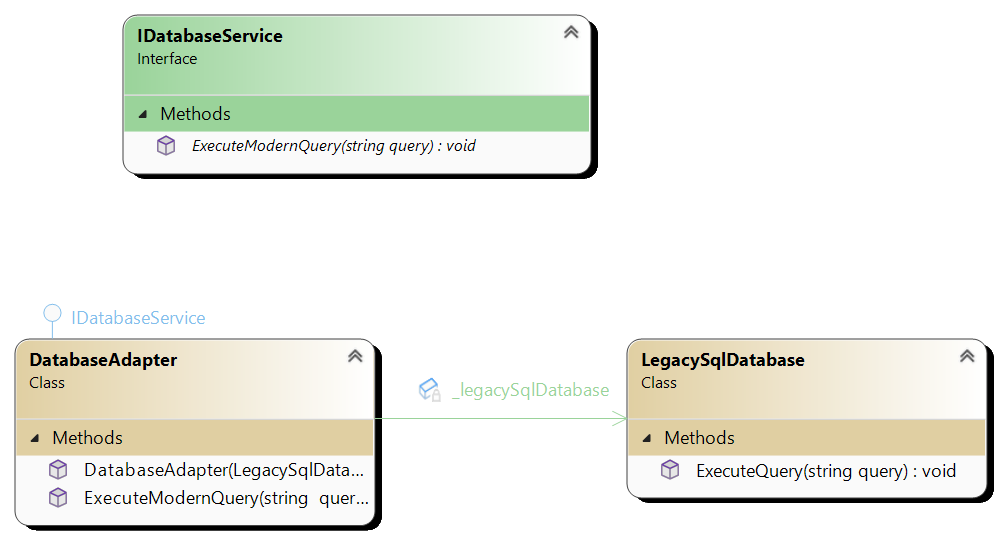

# Adapter

Adapter (sometimes called Wrapper) is structural design patterns that allows incompatible components to work together.
For example if we have new API for getting stuff from database using implementation if IDatabaseService which has
ExecuteModernQuery but for some reason we want to use query that already exist in LegacySqlDatabase class we can adapt this LegacySqlDatabase
(this is adaptee) to the new interface. Adaptee is passed inside of constructor of the adapter. Adapter implements
IDatabaseService and when we call ExecuteModernQuery we actually call method on LegacySqlDatabase.

## Main components

1. **Target interface** Defines interface that client expects. In this case IDatabaseService.
2. **Adapter** implements the target interface and wraps the adaptee, translating requests from the client into calls to adaptee's interface.
3. **Adaptee** Represents an existing class of the system with and incomatible interface that needs to be adapted.

# UML 

