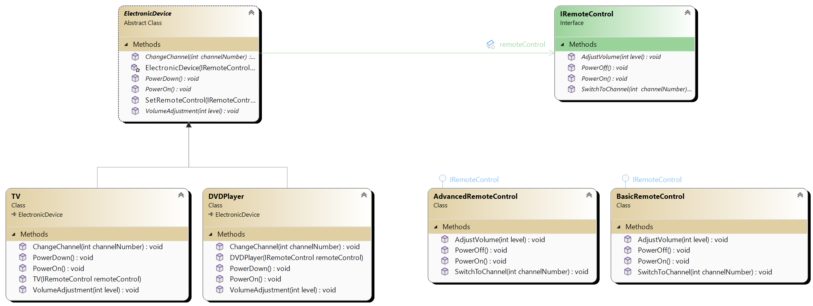

# Bridge

Bridge is structural design patten. Allows variantion in both abstraction and implementation independently.

## Main components

1. **Abstraction** This defines the abstraction's interface and maintains a reference to an object of type Implementor.
It typically provides higher-level operations that internally delegate to the implementor.
2. **Implementor** This defines the interface for concrete implementations. It is decoupled from the Abstraction, allowing
different implemenations to vary independently.
3. **Refined abstraction** This extends the abstraction's interface. It can add additional methods or mdify the behavior of existing methods.
4. **Concrete implementor** This provides concrete implementations of the implementor interface. 

# UML 
In first example Abstraction is ElectronicDevice. It HAS reference to IRemoteControl but any implementation of IRemoteControl can
be injected since any concrete implementor implements IRemoteControl. Concrete abstraction has methods like TurnOn same as IRemoteControl
which calls under the hood. But any concrete abstraction like TV can be changed independently from any instance of IRemoteControl like
BasicRemoteControl.

Example 2:

