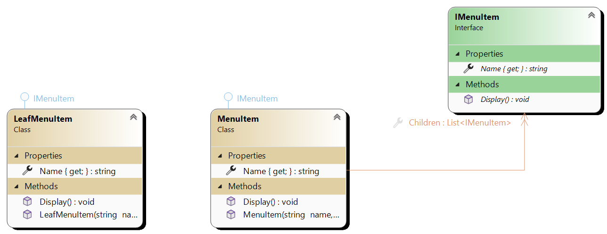

# Composite

Composite is structural design pattern that allows to compose object in tree like structure. It lets client
treat individual objects and compositions the same way. So, we both component (which doesn't have children) and composite are of same type
IComponent. Client can treat them the same way since they are both IComponent, but they are still different.

# Main components

1. **Component** Defines the interface for all objects in composition
2. **Leaf** Represents individual objects in composition that do not have any children. Leaf objects implement the operations
defined by the component interface.
3. **Composite** Represents combination of objects, which may contains leaf nodes or other composite nodes.
4. **Client** Manipulates objects in composition througt Composite interface

Second example:

