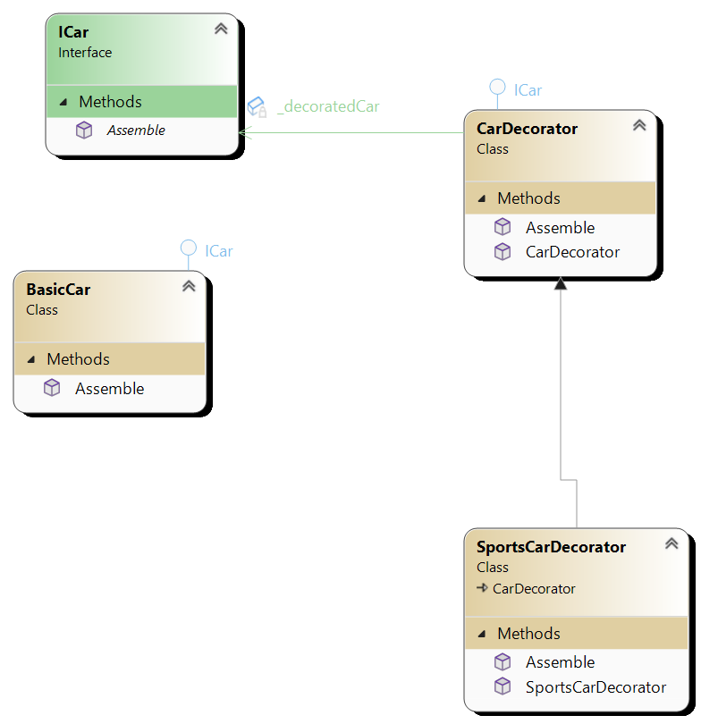

# Decorator pattern
Decorator pattern is structural design pattern that allows behaviour to be added to individual objects, dynamically, without affecting
the behaviour of other objects from the same class.

## Key components
1. **IComponent** This is the base interface or abstract class that defines methods to be implemented by concrete components.
2. **Concrete component** This is class that implements the base component interface
3. **Decorator** This is abstract class that implements the base component interface and maintains reference to an object of the same interface.
 IT IS and HAS IComponent.
4. **Concrete decorator** This is class that extens the decrator abstract class and adds additional behavior.

## UML diagram

There is ICar that all types of the car implement. For example BasicCar implements ICar. There is then CarDecorator
which is base abstract class that all decoerators extend. It is ICar also (inherits ICar) but also has ICar. Receives ICar
from the contructor. That is car or decorated car we want to decorate with additional functionality.

