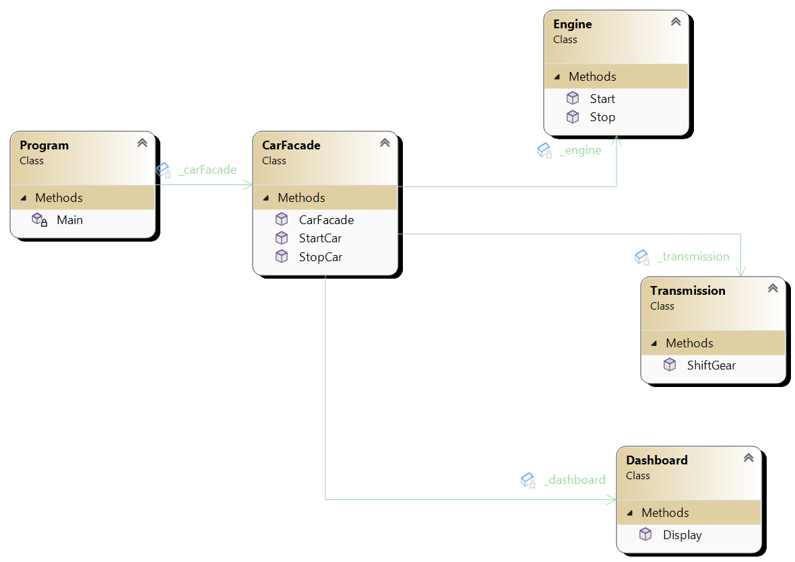

# Facade Pattern

The Facade Pattern is a structural design pattern that provides a simplified interface to a complex system of classes, interfaces, or subsystems. It allows clients to interact with the system through a single interface without needing to know the details of its internal components.

## Intent
- Provide a unified interface to a set of interfaces in a subsystem.
- Define a higher-level interface that makes the subsystem easier to use.

## Structure
- **Facade**: Provides a simple interface to a complex system. It delegates client requests to appropriate subsystem objects.
- **Subsystem Classes**: Implement functionality of the subsystem. Clients interact with these classes through the facade.

## Example
Consider a car system consisting of multiple components such as engine, transmission, and dashboard. Instead of clients directly interacting with these components, a `CarFacade` class can be implemented to provide a simplified interface for starting and stopping the car.

## Implementation
- Identify a complex system with multiple subsystems that can be encapsulated behind a simplified interface.
- Create a facade class that delegates client requests to appropriate subsystem objects.
- The facade class should shield clients from the complexity of the subsystems and provide a clear, simple interface.
- Clients interact with the system through the facade, which handles the interactions with the subsystems.

## When to Use
- When you need to provide a simple interface to a complex system.
- When you want to encapsulate the complexity of multiple subsystems.
- When you need to decouple client code from the implementation details of subsystems.

## Benefits
- Simplifies client code by providing a unified interface.
- Encapsulates the complexity of the subsystems, making the system easier to understand and maintain.
- Promotes loose coupling between clients and subsystems.

## Drawbacks
- May hide too much complexity, making it difficult to access lower-level functionality when needed.
- Introduces an additional layer of abstraction, which can increase the complexity of the overall system.

## Real-World Examples
- Modern software frameworks often use facades to provide simplified interfaces for complex subsystems, such as GUI libraries, database access layers, and web service APIs.
- In a video game engine, a rendering facade might provide a simplified interface for rendering graphics, hiding the complexity of interacting with graphics APIs like DirectX or OpenGL.

## Related Patterns
- **Adapter Pattern**: Facade can use adapters to convert the interface of a subsystem into a compatible interface for the client.
- **Singleton Pattern**: Facade may implement a singleton to ensure there is only one instance of the facade class.
- **Composite Pattern**: Facade can use the composite pattern to treat individual objects and compositions of objects uniformly.

