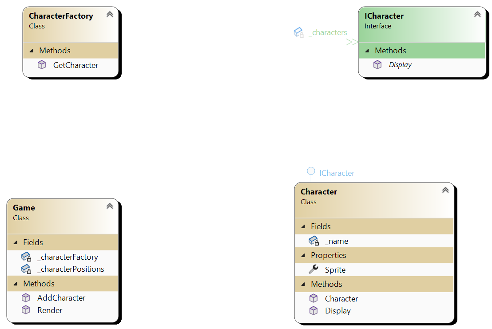

# Flyweight Pattern

The Flyweight Pattern is a structural design pattern aimed at minimizing memory usage or computational expenses by sharing as much as possible among similar objects. It achieves this by sharing common portions of state between multiple objects instead of storing it individually for each object.

## Intent

- Reduce memory usage or computational costs by sharing common state among multiple objects.
- Separate intrinsic state (shared) from extrinsic state (unique) to achieve memory optimization.

## Structure

- **Flyweight**: Declares an interface through which flyweight objects can receive and act on extrinsic state. Contains the operation method that receives extrinsic state.
  
- **ConcreteFlyweight**: Implements the Flyweight interface. Represents a shared flyweight object that can be shared and reused among multiple contexts. Contains the intrinsic state.

- **FlyweightFactory**: Manages a collection of flyweight objects. Provides a method to retrieve or create a flyweight object based on a given key. Ensures that flyweight objects are shared and reused where possible.
  
## Example

Consider a text editor application where multiple characters share the same font and size. Instead of storing font and size information for each character, a flyweight pattern can be used to share this common state among characters, thus reducing memory usage.

## Implementation

- Identify objects that can be shared and have common state.
- Separate intrinsic state (shared) from extrinsic state (unique).
- Create flyweight objects to represent shared state and manage them using a flyweight factory.
- Ensure that clients provide extrinsic state when interacting with flyweight objects.

## When to Use

- When a large number of objects need to be created, and many of them share common characteristics or state.
- When memory usage or computational expenses need to be minimized by sharing common state among multiple objects.
- When you want to optimize performance in resource-intensive applications.

## Benefits

- Reduces memory usage by sharing common state among multiple objects.
- Improves performance by minimizing computational costs associated with creating and managing objects.
- Promotes reusability and efficiency in resource-intensive applications.

## Drawbacks

- May introduce complexity in managing shared state and extrinsic state.
- Can lead to increased coupling between flyweight objects and their clients if not implemented carefully.

## Real-World Examples

- Text editors or word processing applications that use flyweight pattern to share font and formatting information among characters.
- Graphics rendering engines that use flyweight pattern to share common graphical elements such as textures or patterns among multiple objects.

## Related Patterns

- **Factory Method Pattern**: Flyweight pattern often uses factory methods to create and manage flyweight objects.
- **Singleton Pattern**: Flyweight factory may implement singleton to ensure that only one instance exists to manage flyweight objects.
- **Proxy Pattern**: Flyweight pattern can be combined with proxy pattern to control access to flyweight objects and provide additional functionality.

