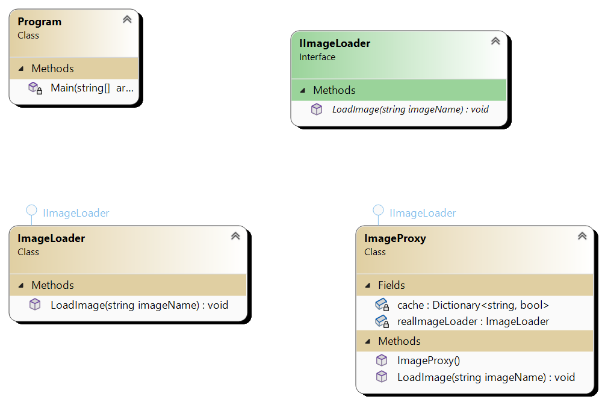

### Proxy Pattern

#### Definition:
The Proxy pattern provides a surrogate or placeholder for another object to control access to it.

#### Main Components:
1. **Subject**: Defines the common interface for the RealSubject and Proxy, so that a Proxy can be used anywhere a RealSubject is expected.
2. **RealSubject**: Represents the real object that the Proxy represents.
3. **Proxy**: Acts as an intermediary between the client and the RealSubject, controlling access to it and providing additional functionality.

### Example:
Imagine you have a `FileDownloader` class that downloads files from a remote server. To enhance the performance and manage resources, you introduce a
`ProxyFileDownloader` class. This proxy caches the downloaded files and provides them directly if requested again, instead of downloading them
anew from the server.

